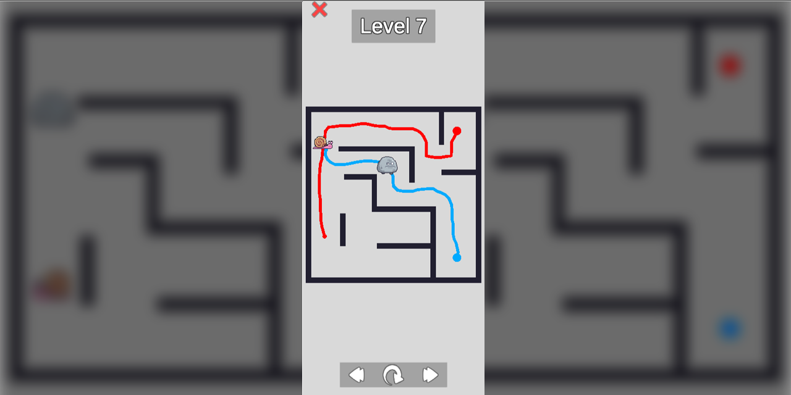

# Draw Puzzle HTML
HTML-билд проекта **Draw-Puzzle**. [Код проекта](https://github.com/skrininshot/Unity-Draw-Puzzle/)

## Геймплей

Игроку предстоит решать головоломки с использованием основной механики - рисование траекторий дивжений персонажей. После того как линии нарисованы, начинается движение персонажей, им следует избегать столкновений с препятствиями, ловушками и друг-другом.

[Играть](https://skrininshot.github.io/Draw-Puzzle-WebGL/)
